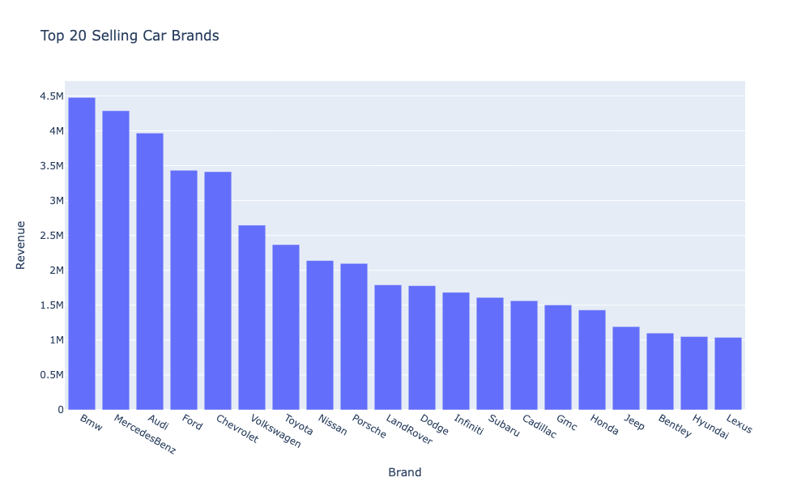
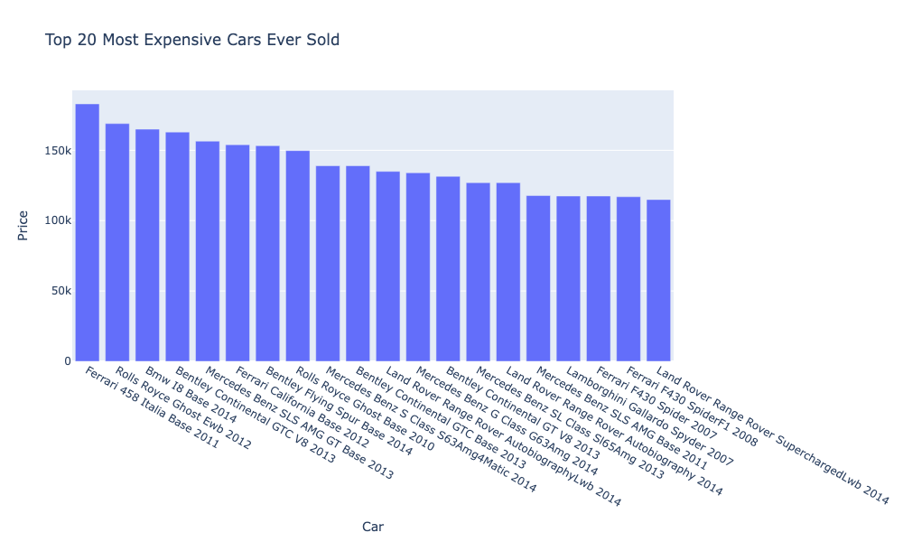
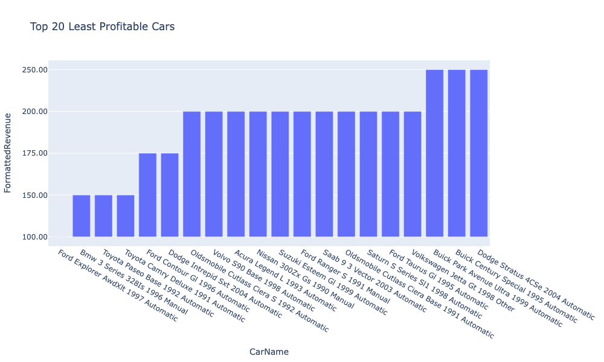
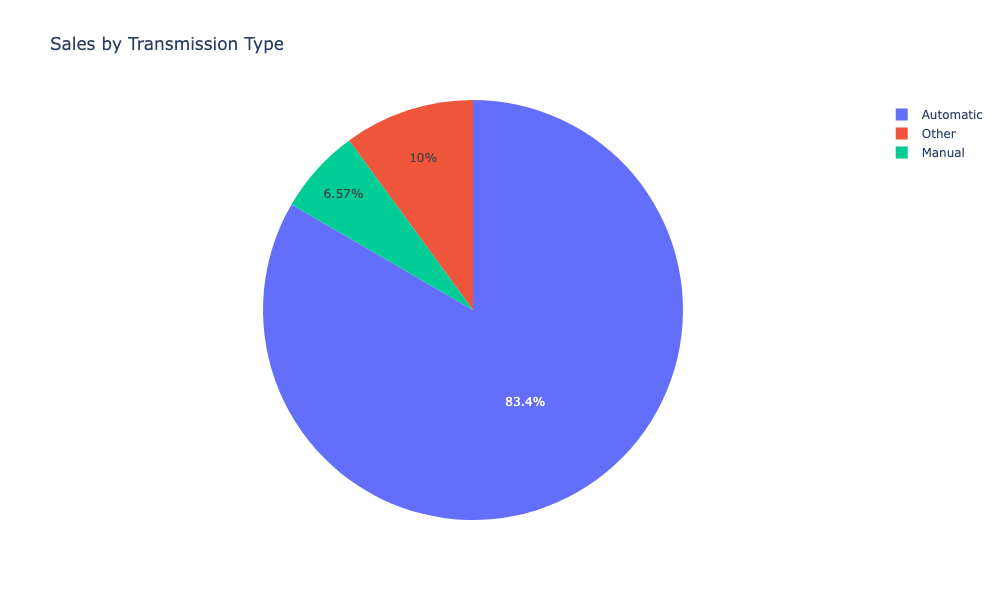
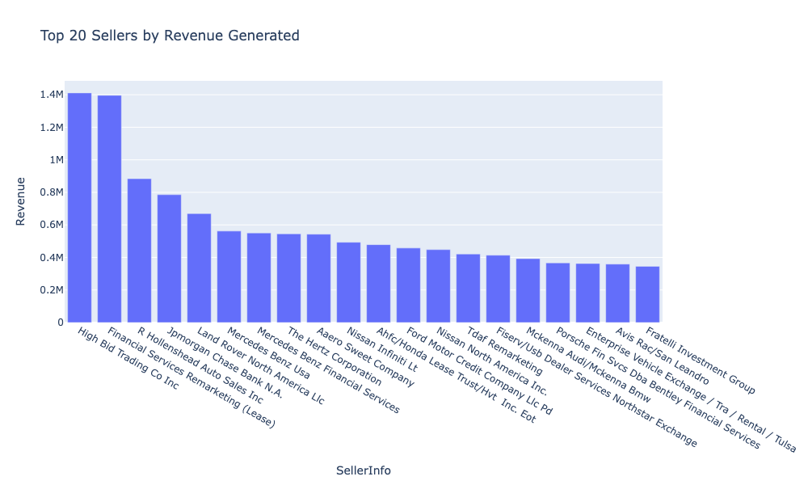
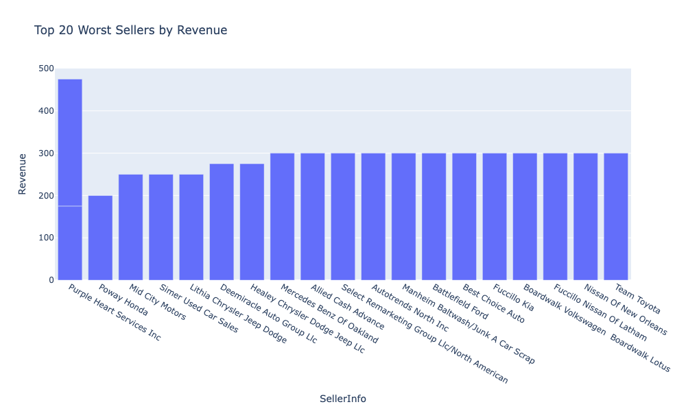
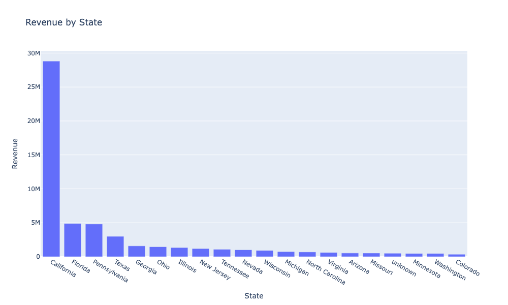
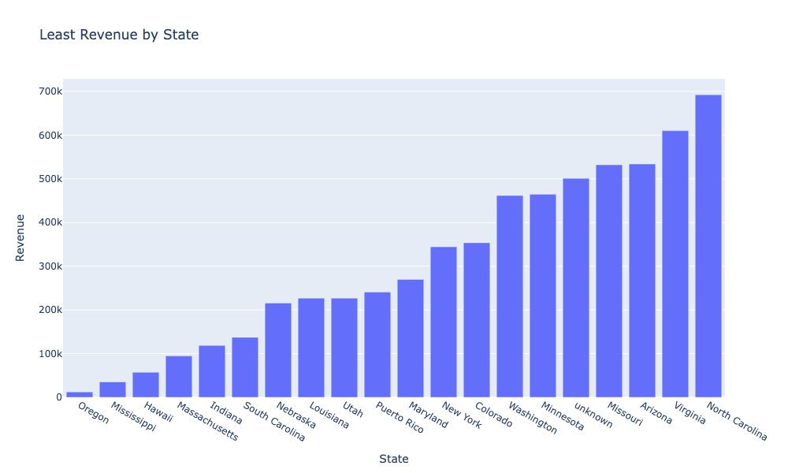

# Introduction
This is my personal data analysis project. I downloaded the dataset from <a href='' >Kaggle</a>. 
this is not an offical real-world project, but solely for the purpose of self-teaching data analysis and practicing my Python skills.

# Techonologies
- Interactive Python Notebook (Jupyter Notebook)
- Pandas
- Plotly 

# The Pipeline

## Data Cleaning (Pandas)
- Imputed values of string (object in Pandas) type containing null values with the mode of the column
- Imputed values of integer/float type containing null values with the mean of the column
- Removed all duplicate rows
- Applied camle-casing on some column header titles
- Capitalised column header titles
- Validated the data type of values column by column
- Normalised Make titles, merged TK with the brands, also abbreviations to full brand names
- Normalised state names and converted them from 2 lower case letter abbreviations to full state names
- Ensured that the Transmission values are either 'Automatic', 'Manual', or 'unknown' (imputed for Nulls)
- Similarly, Ensured that the Color values are either from a list of normal colors or 'unknown' (imputed for Nulls)
- DataCleaner.save_changes() saves all the changes and created a new csv file in './dataset/cleaned/'

## key Analysis Points
- German brands have been doing tremendously. 5/10 selling cars are German:
    1- BMW 
    2- Mercedes-Benz
    3- Audi
    4- Volkswagen
    5- Porsche
- 1990's were bad time in terms of sales, and majority of least profitable cars range from 1991-2004.
- California account for an overwhelming amount of the revenue, $28.81M, followed by Florida, $4.88M, Pennsylvania, $4.81M, and Texas, $2.99M.
- 18 out of 20 dealerships with highest generated are based in California as well as 6 of the least profitable ones.
-  R Hollenshead Auto Sales Inc from Pennsylvania and TDAF Remarketing from FLorida are the only non-Californian sellers in the top-20 most profitable sellers.
- A strong positive correlation between number of vehicles and the revenue of a brand. Quantity and consequently more options is a deciding factor.
- Condition of the cars could quite effectively be a strong reason for customers to buy a car.
- The number on odometer is often overlooked by customer and it doesn't influence the sales tremendously.
- US. terittories are amongst least profitable state, including Hawaii, Puerto Rico, and Alaska
- Only 10 states have generated over $1M
- Selling price plays a moderately weak role in the generation of revenue (0.3 coefficiency).
- The Great Depression did not affect our sales significantly. Experiencing a 19.17% incraese in 2007-2008, and only 16.8% decrease in 2008-2009.
- 2010-2011 witnessed a massive spike in revenue increase. Going from $3.06M to $6.6M (53.6%) followed by 26.6% in 2011-2012 ($6.6M to $9M).
  
    
## Visualisations (Plotly)

