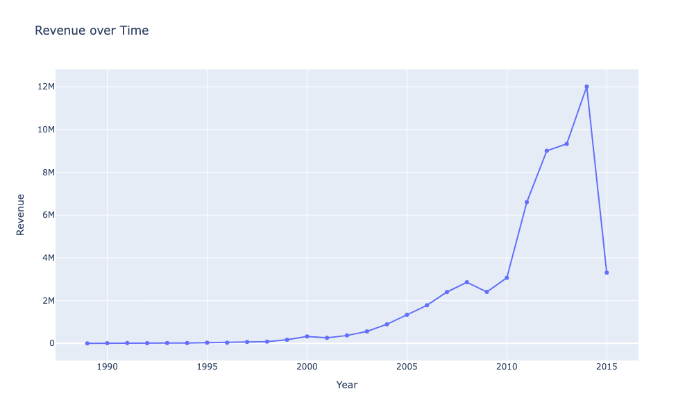

# Introduction
This is my personal data analysis project. I downloaded the dataset from <a href='' >Kaggle</a>. 
this is not an offical real-world project, but solely for the purpose of self-teaching data analysis and practicing my Python skills.

# Techonologies
- Interactive Python Notebook (Jupyter Notebook)
- Pandas
- Plotly 

# The Pipeline

## Data Cleaning
- Imputed values of string (object in Pandas) type containing null values with the mode of the column
- Imputed values of integer/float type containing null values with the mean of the column
- Removed all duplicate rows
- Applied camle-casing on some column header titles
- Capitalised column header titles
- Validated the data type of values column by column
- Normalised Make titles, merged TK with the brands, also abbreviations to full brand names
- Normalised state names and converted them from 2 lower case letter abbreviations to full state names
- Ensured that the Transmission values are either 'Automatic', 'Manual', or 'unknown' (imputed for Nulls)
- Similarly, Ensured that the Color values are either from a list of normal colors or 'unknown' (imputed for Nulls)
- DataCleaner.save_changes() saves all the changes and created a new csv file in './dataset/cleaned/'
  
    
# Visualisations

